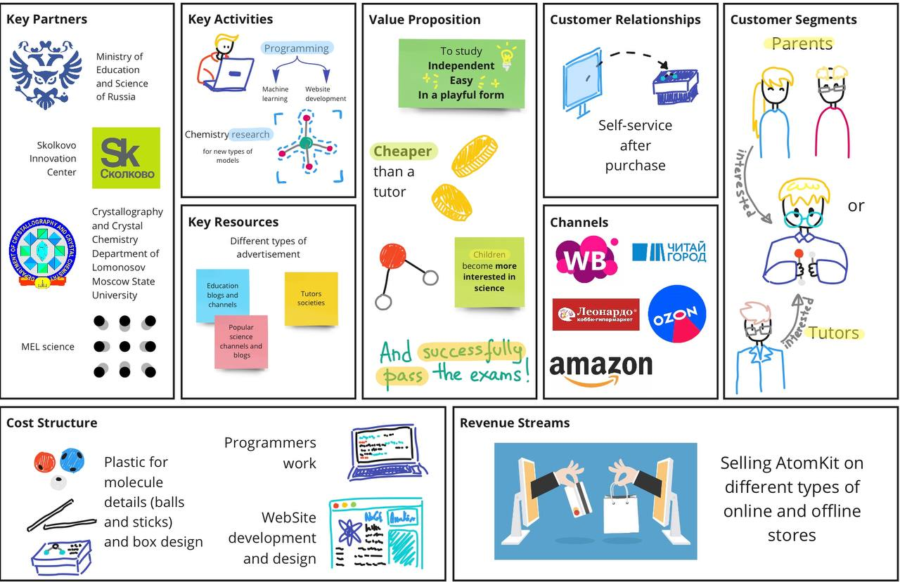

# AtomKit

AtomKit — это инновационное решение, использующее нейросеть, обученную на моделях кристаллов, для распознавания химических молекул при загрузке изображения в Telegram-бот.

У проекта также есть MVP и [Landing Page](http://atomkit.tilda.ws/page39900186.html).

## Видео-обзор проекта

## Links

[Telegram bot](https://t.me/atomkitscan_bot) – needs to be started, ask me if you want to test it yourself

[Landing Page](http://atomkit.tilda.ws/page39900186.html) – also needs to be started

## Описание

AtomKit бот использует машинное обучение для распознавания химических молекул на основе их структуры. На текущий момент нейросеть обучена на нескольких самплах, поэтому пока что распознаются только следующие молекулы:
- Hydrogen (H2)
- Oxygen (O2)
- Water (H2O)

## Как это работает?

**Телеграм-бот AtomKit**: Отправьте фото химического элемента в [Telegram bot](https://t.me/atomkitscan_bot), и он скажет вам название собранной молекулы.

## Osterwalder BM 

Trained ML models used for detection and other materials were too big to upload, so they can be found in [AtomKit asssets](https://disk.yandex.ru/d/MOP1_nM5Do5y7A)

## Лицензия
Этот проект лицензирован по лицензии MIT. Подробную информацию смотрите в файле [License](/LICENSE).
